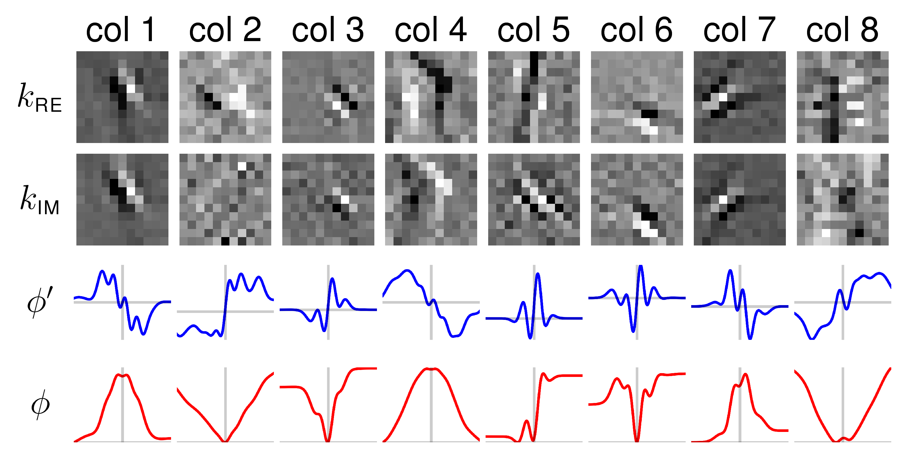

# Variational Network for Magnetic Resonance Image (MRI) Reconstruction

This repository provides a tensorflow implementation used in our publications
 - Hammernik et al., [*Learning a variational network for reconstruction of accelerated MRI data*](https://onlinelibrary.wiley.com/doi/abs/10.1002/mrm.26977), Magnetic Resonance in Medicine, 79(6), pp. 3055-3071, 2018.
 - Knoll et al., [*Assessment of the generalization of learned image reconstruction and the potential for transfer learning*](https://onlinelibrary.wiley.com/doi/abs/10.1002/mrm.26977), Magnetic Resonance in Medicine, 2018 (early view).

 If you use this code and provided data, please refer to:

```
@article{doi:10.1002/mrm.26977,
    author = {Hammernik Kerstin and Klatzer Teresa and Kobler Erich and Recht Michael P. and Sodickson Daniel K. and Pock Thomas and Knoll Florian},
    title = {Learning a variational network for reconstruction of accelerated MRI data},
    journal = {Magnetic Resonance in Medicine},
    volume = {79},
    number = {6},
    pages = {3055-3071},
    keywords = {variational network, deep learning, accelerated MRI, parallel imaging, compressed sensing, image reconstruction},
    doi = {10.1002/mrm.26977},
    url = {https://onlinelibrary.wiley.com/doi/abs/10.1002/mrm.26977},
    eprint = {https://onlinelibrary.wiley.com/doi/pdf/10.1002/mrm.26977},
}
```

## Requirements (Update January 2021)
~~This framework requires Python 3 and the [tensorflow-icg](https://github.com/VLOGroup/tensorflow-icg) repository, which is forked from [Tensorflow]() and additionally provides custom operators, functions and classes to build and train the variational network (VN). Please follow the instructions there to correctly install `tensorflow-icg`.~~

We provide an environment file `environment.yml`. A new conda environment `mrivn` can be 
created with 
```
conda env create -f environment.yml
```
The framework was tested with Tensorflow 1.15. This omits the self-written kernels for (i)fftshift in the previous `tensorflow-icg`.

This framework requires the [optox](https://github.com/VLOGroup/optox) repository. Please follow the instructions there to correctly install optox. Optox needs to be configured with
```
mkdir build
cd build
cmake .. -DWITH_PYTHON=OFF -DWITH_PYTORCH=OFF -DWITH_TENSORFLOW=ON -DCMAKE_BUILD_TYPE=Release
```
Note: `optox` unittests do not support TF 1.x.

## Data
We hosted all data that we used for our experiments at [GLOBUS](https://app.globus.org/file-manager?origin_id=15c7de28-a76b-11e9-821c-02b7a92d8e58&origin_path=%2F).

Parameters used for training such as batch size, dataset, etc. can be configured in the file `configs/data.yaml`. The training uses a multi-threaded implementation
for data loading. To adapt the number of threads used for training as well as
the maximum queue size, you can change the corresponding parameters in `configs/global.yaml`.

The correct paths, especially the data `base_path` in `configs/data.yaml` and
`configs/reco.yaml` have to be set to the correct path.

## Trainable parameters
For details on the algorithm we refer to [1-4]. We train individual filter kernels, activation functions and dataterm weights for each of the *Ns* stages.
- Filter kernels: arbitrary *Nk* filter kernels with zero-mean and L2 norm <= 1.
- Activation functions: Weighted combination of *Nw* Gaussian radial basis functions (RBFs), defined in the range *[vmin, vmax]*.
- Dataterm weights >= 0

All these parameters can be configured in the file `configs/mri_vn.yaml`, which also provides the possibility to configure the initialization for the dataterm weights and activation functions.

## Training
For training, we use the iPALM optimizer [5] which allows us to handle the additional constraints on the parameters easily. The number of training iterations
can be set in the file `configs/training.yaml`. Additionally, you can define
the location of the log directory there. In some cases, you have to set the correct GPU in `CUDA_VISIBLE_DEVICES`.

```
python train_mri_vn.py
```
You can oberserve the progress of the training in Tensorboard using the specified log directory.

## Testing
To test a trained model with the name `model_name` from the log directory on a specific image slice defined in `reco_config`, use the python script

```
python reconstruct_image.py reco_config model_name
```
We provide a sample `reco_config` in `./configs/reco.yaml`. The output is a
`*.mat` file with the reconstruction as well as a `*.png` file.

You can also reconstruct a whole patient volume using the python script
```
python reconstruct_patient.py reco_config model_name
```

## Evaluation
To evaluate a trained model with the name `model_name` from the log directory on a specific image slice defined in `reco_config`, use the python script
```
python evaluate_image.py reco_config model_name
```
The RMSE and SSIM which are estimated slice-per-slice on the re-normalized image are displayed in the console. The output are `*.mat` and `*.png` files of the
variational network, zero filling and reference reconstructions.

You can also reconstruct a whole patient volume using the python script
```
python evaluate_patient.py reco_config model_name
```

## Global valuation of all available experiments
To evaluate all experiments in your log directory you can execute.
```
python evaluate_mri_vn.py
```
The evaluation is based on the listed `eval_patients` in the provided `data_config` (default: `./configs/data.yaml`).

## Plot parameters
To plot the parameters of a trained model with the name `model_name` from the log directory, use the python script

```
python plot_parameters.py model_name
```
The parameters are stored in the `model_name` directory.

A sample parameter set is visualized here:
<div><div align="center">

</div>

## References
1. K Hammernik, T Klatzer, E Kobler, DK Sodickson, MP Recht, T Pock, F Knoll. [*Learning a variational network for reconstruction of accelerated MRI data*](https://onlinelibrary.wiley.com/doi/abs/10.1002/mrm.26977). Magnetic Resonance in Medicine, 79(6), pp. 3055-3071, 2018.

2.  Y Chen, W Yu, T Pock. [*On learning optimized reaction diffusion processes for effective image restoration*](https://arxiv.org/abs/1503.05768). Proceedings of the IEEE Conference on Computer Vision and Pattern Recognition, pp. 5261-5269, 2015.

3. E Kobler, T Klatzer, K Hammernik, T Pock. [*Variational Networks: Connecting Variational Methods and Deep Learning*](https://link.springer.com/chapter/10.1007/978-3-319-66709-6_23). German Conference on Pattern Recognition, pp. 281-293, 2017.

4. F Knoll, K Hammernik, E Kobler, T Pock, MP Recht, DK Sodickson. [*Assessment of the generalization of learned image reconstruction and the potential for transfer learning*](https://onlinelibrary.wiley.com/doi/abs/10.1002/mrm.26977), Magnetic Resonance in Medicine, 2018 (early view).

5. T Pock and S Sabach. [*Inertial Proximal Alternating Linearized Minimization (iPALM) for Nonconvex and Nonsmooth Problems*](https://arxiv.org/abs/1702.02505). SIAM Journal on Imaging Science, 9(4), pp. 1756–1787, 2016.
